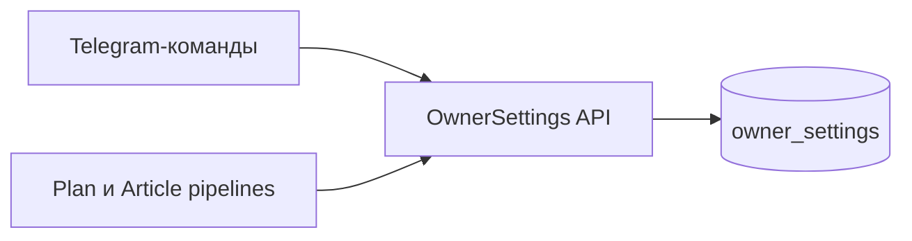
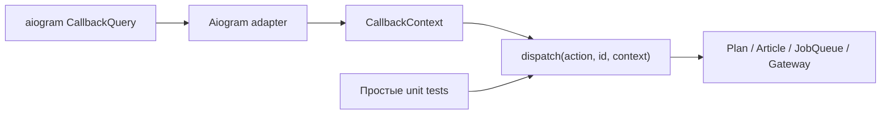
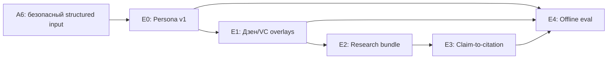

# План технического укрепления и подготовки Content Zavod к SaaS

**Дата:** 12 августа 2026 года
**База:** `origin/master` (`c388cf1`)
**Связанный аудит:** `docs/reviews/2026-08-12-technical-audit.md`

## Цель

Подготовить Content Zavod к безопасной эксплуатации и последующей продаже как SaaS, сохранив текущий Telegram-first сценарий и не переписывая работающие модули целиком.

План разделён на три потока:

1. точечное исправление найденных дефектов;
2. автоматические проверки качества перед commit и в CI;
3. продуктовая и техническая готовность к продаже SaaS.

## Принципы выполнения

- Один небольшой PR решает одну проблему или один связанный инвариант.
- Сначала закрепляется текущее ожидаемое поведение targeted-тестом, затем меняется код.
- Полный `pytest` не является обязательным для каждого маленького PR. Обязательны targeted tests затронутой области и `ruff check`/`ruff format --check`.
- Для конкурентности, idempotency, membership, биллинга и tenant isolation тесты обязательны: эти дефекты невозможно надёжно проверить визуально.
- Live Telegram/Yandex/LLM вызовы не входят в обычную проверку; используются fakes и sanitised fixtures.
- Новые схемы БД вводятся через версионные миграции, а не только `CREATE TABLE IF NOT EXISTS`.
- Изменения rollout-ятся совместимо: expand schema → deploy code → backfill → contract schema.

## Поток A — точечное исправление проблем

### A0. Зафиксировать baseline

**Результат:** известен минимальный набор команд, которые можно выполнять локально и в CI.

- Убедиться, что `uv sync --all-groups` воспроизводит окружение Python 3.12.
- Добавить короткие команды в README: targeted pytest, Ruff check и Ruff format check.
- Не исправлять существующий стиль массовым форматированием в feature-PR: отдельный механический PR при необходимости.

**Acceptance:** чистая установка из `uv.lock`; CI выполняет одинаковые команды.

### A1. Исправить полную Перегенерацию Плана

**Scope:** `telegram/generate_plan_command.py`, `domain/plan.py`, `job_queue/queue.py`, targeted tests.

- Разделить автоматическую идемпотентную генерацию недели и явную Перегенерацию.
- Добавить `generation_id`/revision в payload и idempotency key явной Перегенерации.
- Архивировать текущий План и создавать новую job атомарно либо сначала гарантировать создание job, затем архивировать.
- Не переиспользовать завершённую job как новый запуск.

**Acceptance:** `archive → regenerate → новая queued job`; повтор одного и того же callback не создаёт две job; обычный weekly trigger остаётся идемпотентным.

### A2. Добавить lease heartbeat и fencing

**Scope:** `job_queue` schema/models/queue/worker и тесты с двумя worker.

- Добавить уникальный `lease_token` для каждого claim.
- Worker продлевает lease во время длительного pipeline.
- `complete`/`fail` обновляют job только при совпадающем токене.
- `recover_stuck` возвращает только действительно потерянные lease.

**Acceptance:** живая job не захватывается вторым worker; старый worker не может завершить job после потери lease.

### A3. Сделать application результата идемпотентным

**Scope:** notification handler, Article/Plan persistence, Telegram gateway.

- Ввести application receipt по `job_id`.
- Связать Версию Статьи с `source_job_id` уникальным ограничением.
- Разделить применение результата в БД и внешнюю доставку.
- Для Плана сохранять канонический `chat_id/message_id` и выполнять edit/upsert вместо повторного сообщения.

**Acceptance:** сбой Telegram после DB commit и повтор handler не создают новую Версию и второе каноническое сообщение.

### A4. Закрыть lifecycle ошибок Статьи

- При окончательном fail переводить соответствующую Статью в `error` по актуальному job/generation ID.
- Не позволять старой job перезаписать состояние более новой генерации.
- Разрешить явный retry из `error`.

**Acceptance:** initial generation и Перегенерация после исчерпания retries оказываются в `error`; новый retry снова запускает генерацию.

### A5. Исправить конкурентные операции домена

- `join_requests.resolve`: атомарный `UPDATE ... WHERE status='pending' RETURNING`.
- `Plan.add_topics`: DB constraint на единственный активный План недели и транзакционный upsert/lock.
- `JobQueue.retry`: разрешать только `failed`.
- `apply_regeneration`: проверять `UPDATE 0` и возвращать typed stale-result error.

**Acceptance:** конкурентные тесты подтверждают одного победителя и отсутствие противоречащих side effects.

### A6. Укрепить prompt pipeline

- Ограничить длину Голоса, Ниши, Направлений и комментария.
- Передавать недоверенные данные как структурированные поля с явными delimiters.
- Зафиксировать неизменяемые правила pipeline отдельно от редактируемого Голоса.
- Перейти от свободного `Title/Summary/Keywords` к JSON schema и bounded retry.
- Sensitive-классификатор применить к title, summary, keywords, previous content и comment.

**Acceptance:** attack success rate на offline corpus — `0%`; malformed output acceptance — `0%`; sensitive recall — не ниже `95%`.

### A7. Ввести реальный контракт Источников

- Генерация возвращает атомарные claims и кандидаты Источников.
- URL checker проверяет policy URL и сетевую безопасность, не только доступность.
- Проверять соответствие claim/source, дату и разрешённые/авторитетные домены.
- Неподтверждённые claims помечать либо возвращать на bounded rewrite.

**Acceptance:** нерелевантная homepage, redirect, private-network URL и 404 не принимаются; для каждой требующей подтверждения цифры есть валидный Источник.

### A8. Улучшить Wordstat ranking и платформенные rubric

- Сортировать временные точки по дате.
- Ввести minimum volume, устойчивый slope/log-volume и защиту от одиночного всплеска/сезонности.
- Описать проверяемые различия Дзена и VC: аудитория, структура, длина, тон, CTA.
- Добавить paired offline eval.

**Acceptance:** ranking не зависит от порядка точек; низкочастотный шум не побеждает устойчивый рост; сходство пар Дзен/VC ниже согласованного порога.

### A9. Добавить provenance и cost accounting

- Для каждого LLM/image step сохранять provider, model, параметры, prompt template version/hash, input snapshot/hash, tokens, latency и reported cost.
- Стоимость job равна сумме попыток и шагов, а не `0.0`.
- Добавить лимиты бюджета на tenant/job и алерты missing usage.

**Acceptance:** provenance completeness — `100%`; сумма step costs совпадает с job cost; версия объяснима без чтения логов.

### A10. Миграции, scheduler reconciliation и VPS runbook

- Ввести Alembic или аналогичный migration runner.
- На старте делать reconciliation текущей недели либо использовать persistent scheduler store.
- Описать systemd/container запуск bot и worker, health/readiness, backups, restore rehearsal, rollback и stuck-job operations.

**Acceptance:** upgrade тестируется на копии существующей схемы; пропущенный weekly trigger восстанавливается; documented rollback выполняется без потери данных.

## Поток B — Ruff и проверки перед commit

### B1. Ruff как единый lint/format инструмент

На август 2026 официальный Ruff workflow использует `ruff-check` и `ruff-format`; Ruff добавляется в dev dependencies через `uv`.

Добавить в `pyproject.toml`:

```toml
[dependency-groups]
dev = [
    # existing dependencies
    "pre-commit>=4.0",
    "ruff>=0.16,<0.17",
]

[tool.ruff]
target-version = "py312"
line-length = 100
force-exclude = true

[tool.ruff.lint]
select = ["E4", "E7", "E9", "F", "I", "B", "UP", "ASYNC", "RUF"]

[tool.ruff.format]
quote-style = "double"
indent-style = "space"
```

Правила включать поэтапно. Если baseline выдаёт много замечаний, сначала оставить безопасное ядро `E4/E7/E9/F/I`, затем отдельными PR включать `B/UP/ASYNC/RUF`. Не добавлять массовый список `ignore` без issue и причины.

### B2. Pre-commit

Создать `.pre-commit-config.yaml` с закреплёнными версиями:

```yaml
repos:
  - repo: https://github.com/pre-commit/pre-commit-hooks
    rev: <pinned-release>
    hooks:
      - id: check-toml
      - id: check-yaml
      - id: check-merge-conflict
      - id: end-of-file-fixer
      - id: trailing-whitespace

  - repo: https://github.com/astral-sh/ruff-pre-commit
    rev: v0.16.0
    hooks:
      - id: ruff-check
        args: [--fix]
      - id: ruff-format
```

`ruff-check --fix` располагается перед formatter, как рекомендует официальная интеграция Ruff.

Установка:

```bash
uv sync --all-groups
uv run pre-commit install
uv run pre-commit run --all-files
```

### B3. CI остаётся источником истины

Локальный hook можно пропустить через `--no-verify`, поэтому CI обязан повторять проверки:

```bash
uv run ruff check --output-format=github .
uv run ruff format --check .
uv run pytest
```

Для экономии времени targeted pytest может выполняться локально, но merge защищается полным CI. Версии Ruff/pre-commit фиксируются в `uv.lock`, Renovate/Dependabot обновляет их отдельным PR.

## Поток C — чего не хватает для продажи как SaaS

### C0. Сначала выбрать коммерческую границу

Текущая модель — один Telegram-чат, один набор настроек и одна общая БД. Для SaaS нужно определить продаваемую единицу:

- **Workspace/Организация** — клиент и граница данных;
- **Пользователь** — Владелец или Контент-менеджер внутри Workspace;
- **Telegram connection** — бот/чат, привязанный к Workspace;
- **Subscription** — тариф, лимиты и состояние оплаты.

Без этого нельзя безопасно добавлять биллинг или несколько клиентов.

### C1. Multi-tenancy и tenant isolation

- Добавить `workspace_id` во все пользовательские и контентные сущности, jobs, settings и audit events.
- Все repository methods требуют tenant context; запретить глобальные выборки по ID без `workspace_id`.
- Уникальные constraints и idempotency keys включают Workspace.
- Выбрать модель: shared schema с tenant key для MVP; отдельные БД — позже для enterprise.
- Добавить cross-tenant negative tests.

**Gate:** ни один Workspace не может прочитать, изменить, экспортировать или получить notification другого.

### C2. Регистрация и onboarding

- Self-service создание Workspace.
- OAuth/Telegram linking без ручной записи allowlist в БД.
- Invite flow, подтверждение Владельца, удаление/отзыв участника.
- Onboarding wizard: Ниша, Голос, Направления, Площадки, расписание и пробная генерация.
- Тестовый режим без реальной публикации и понятные ошибки настройки API.

### C3. Тарифы, metering и billing

- Определить billable units: tokens/calls, Статьи, обложки, seats или пакет usage.
- Immutable usage ledger по Workspace/job/provider.
- Plan limits и hard/soft quota до запуска платного API.
- Subscription lifecycle: trial, active, past_due, cancelled, grace period.
- Webhook inbox с signature verification и idempotency.
- Invoice/receipt и прозрачный usage dashboard.

На российском рынке провайдер платежей и требования к чекам/налогам выбираются отдельно с юристом и бухгалтером; архитектура billing provider должна быть заменяемой.

### C4. Web control plane

Telegram удобен для ежедневного workflow, но для продаваемого SaaS требуется web-панель:

- Workspace, пользователи и роли;
- настройки Голоса/Ниши/Направлений и Площадок;
- очередь, ошибки, retry и история Версий;
- usage, лимиты и оплата;
- audit log;
- export/delete данных;
- support diagnostics без показа secrets.

Telegram остаётся каналом взаимодействия, а web — control plane.

### C5. Безопасность и privacy baseline

- Threat model с tenant boundaries, Telegram spoofing, prompt injection, SSRF, billing/webhook abuse и admin/support access.
- Secret manager и ротация ключей; per-environment credentials.
- Encryption in transit/at rest, минимальные DB privileges.
- Audit log для membership, settings, billing, exports и административного доступа.
- Retention policy для prompts, generated content, Telegram IDs и logs.
- Export/delete Workspace и обработка запросов субъекта данных.
- Rate limits, abuse prevention и budget circuit breakers.

### C6. Надёжность и поддержка

- SLO: generation success rate, queue latency, notification latency и API error rate.
- Structured logs с correlation IDs `workspace_id/job_id/article_id`, без содержимого secrets.
- Metrics и alerting по stuck jobs, retry storms, provider latency/cost и billing webhook failures.
- Backup policy и регулярная restore rehearsal.
- Status page, incident runbook и support escalation.
- Provider abstraction/fallback policy для Yandex и генеративных моделей без silent quality downgrade.

### C7. Коммерческие функции

- Template/version management для Голоса и prompts.
- Brand kit: цвета, обложки, logo rules и reusable presets.
- Approval workflow с назначением ответственного и deadline.
- Контент-календарь и публикационный статус.
- Поддержка дополнительных Площадок как конфигурационных adapters, а не `if platform` по всему коду.
- API/webhooks и интеграции с CMS для более дорогих тарифов.
- Team analytics: throughput, approval time, regeneration rate, cost per approved Статья.

### C8. Юридическая и sales readiness

- Terms of Service, Privacy Policy, DPA/обработка персональных данных.
- Публичное описание использования AI и ограничений проверки фактов.
- Политика copyright/Источников и жалоб на контент.
- SLA и support boundaries по тарифам.
- Pricing page, trial, demo Workspace, onboarding emails/help center.
- Changelog, release notes и публичная security contact/incident channel.

Юридические документы и локальные требования должны проверяться профильным юристом перед продажей.

## Поток D — архитектурное углубление модулей

Источник этого потока — `docs/reviews/architecture-review-2026-08-11.html`. Эти задачи дополняют hardening: они не заменяют исправления A1–A10, а уменьшают стоимость дальнейшего развития.

### D1. Углубить модуль настроек Владельца

**Приоритет:** выполнить рано, до дальнейшего расширения SaaS-настроек.

Сейчас ключи хранения, defaults и parsing Ниши/Голоса/Направлений протекают между `telegram` и pipelines. Ввести предметный интерфейс `OwnerSettings`:

- `niche()` / `set_niche()`;
- `directions()` / `set_directions()`;
- `voice()` / `set_voice()`.

Ключи БД, defaults и `parse_directions` остаются внутри реализации. Команды Telegram отвечают за ввод/рендер, pipelines — за генерацию prompts.



**Acceptance:** нет импортов storage keys/defaults из pipeline в Telegram; один Protocol/API и один набор unit tests.

### D2. Централизовать role gate команд

Вместо повторения membership/role preamble в каждом handler создать регистрацию вида `register(router, command, required_role, handler)`. Из той же декларации строится меню команд.

**Acceptance:** требуемая роль определена один раз; новую owner-only команду невозможно добавить в меню без соответствующего gate.

### D3. Вынести callback dispatcher из aiogram adapter

`entrypoints/bot.py` должен преобразовывать `CallbackQuery` в простой `CallbackContext`, а отдельный dispatcher — разбирать action/id и вызывать домен.



**Acceptance:** callback actions тестируются без сборки aiogram-объектов; owner-only actions находятся в одной таблице; `bot.py` не содержит длинную цепочку `elif`.

### D4. Сузить публичный интерфейс `telegram`

Разделить текущий gateway на:

- внутренний `callback_codec.py`;
- внутренние чистые renderers/keyboards;
- внешний Telegram adapter с коротким публичным API.

Не выполнять как самостоятельную косметическую перестановку: совместить с A3/D3, когда всё равно меняются notification и callback seams.

**Acceptance:** `telegram/__init__.py` экспортирует только используемый внешний контракт; renderers тестируются напрямую как внутренние функции.

### D5. Объединить Postgres test fixtures

Перенести общий `postgres_container` и pool в `tests/conftest.py`; в пакетных `conftest.py` оставить только предметные fixtures.

**Acceptance:** один контейнер на полный прогон, нет пяти копий setup-кода. Это дешёвая задача и хороший первый PR перед конкурентными тестами A2/A5.

## Поток E — адаптация практик ALwrity для контентного ядра

Источник исследования: `ALwrity/ALwrity`, изученный HEAD `9558a1e` от 10 августа 2026 года. Используем проект как архитектурный референс. Прямое копирование исходного кода не допускается до подтверждения лицензии на конкретном коммите: README заявляет MIT, но файл `LICENSE` в исследованном HEAD отсутствовал.

### E0. Persona v1 — типизированный Голос бренда

**Приоритет:** первый продуктовый этап после минимального hardening A6. Это замена свободной строки `voice`, а не новый автономный генератор.

Полезные референсы ALwrity:

- `backend/services/persona/core_persona/core_persona_service.py` — Core Persona и platform adaptations;
- `backend/services/persona/core_persona/prompt_builder.py` — structured schema, completeness и platform schema;
- `backend/services/persona/enhanced_linguistic_analyzer.py` — измеряемые стилевые признаки;
- `backend/models/persona_models.py` — модели Persona и результаты validation;
- `backend/services/persona_data_service.py` и `backend/api/persona_routes.py` — хранение и API.

Ввести доменную Persona следующего минимального состава:

```text
Persona
├── identity: role, core_belief, audience
├── voice: tone, formality, expertise, humor
├── style: sentence_length, paragraph_length, grammatical_person
├── vocabulary: preferred_terms, forbidden_terms
├── cta_style
├── evidence: sample_ids, verbatim_phrases, missing_inputs, confidence
├── version, status
└── platform_profiles: zen, vc_ru
```

Порядок работы:

1. Owner задаёт поля вручную и при желании прикладывает 2–5 эталонных текстов.
2. Детерминированный анализатор считает длину предложений/абзацев, лицо, частотные фразы и другие проверяемые признаки.
3. LLM возвращает только schema-valid JSON и не имеет права превращать содержимое примеров в системные инструкции.
4. Telegram показывает preview; Owner подтверждает новую immutable-версию Persona.
5. Job получает `persona_version_id`, а Версия Статьи хранит snapshot/hash Persona, использованной при генерации.

На первом PR не делать автоматический scraping сайта, web-кабинет и генерацию десятков персон. Сохранить совместимость: текущая строка `voice` мигрирует в начальную Persona, а старый pipeline временно может читать её через adapter.

**Acceptance:** Persona валидируется без LLM; запрещённые значения и чрезмерно длинные поля отклоняются; prompt injection из эталонного текста не меняет системные правила; повторное чтение версии даёт неизменный snapshot; старая статья остаётся объяснима после изменения активной Persona.

### E1. Platform Profile v1 для Дзена и VC.ru

Профиль площадки — управляемый приложением overlay поверх Persona. Пользовательский Голос не может отменить требования безопасности, источников и формата площадки.

- **Дзен:** доступное объяснение, повествовательное вступление, короткие абзацы, расшифровка терминов, мягкий CTA.
- **VC.ru:** деловой тезис в начале, механика кейса, цифры с evidence, ограничения/риски, практический вывод, отсутствие пустого кликбейта.

Задать типизированные поля: audience, opening, structure, length band, evidence policy, terminology, CTA, forbidden patterns. Компилятор prompt собирает `immutable rules + Persona snapshot + Platform Profile + task data`, причём каждый слой передаётся отдельно.

**Acceptance:** неизвестная площадка возвращает typed error; обязательные признаки профиля проверяются offline rubric; paired outputs Дзен/VC различаются по структуре, но сохраняют факты и Голос; platform profile имеет собственную версию/hash.

### E2. Research contract до написания статьи

Не переносить ALwrity research pipeline целиком. Ввести наш небольшой контракт:

1. сформировать research questions и атомарные claims;
2. найти кандидатов источников через заменяемый provider;
3. проверить URL policy/SSRF, дату, автора/издателя и фрагмент evidence;
4. Owner либо policy engine подтверждает разрешённые источники;
5. outline и draft получают только утверждённый research bundle.

Research bundle хранит query, URL, title, publisher, published_at, retrieved_at, excerpt/hash и claim IDs. Сбой поиска переводит результат в `degraded/needs_review`, а не создаёт уверенный текст с придуманными ссылками.

**Acceptance:** модель не может добавить URL вне research bundle; homepage, redirect на нерелевантный документ, private-network URL и устаревший источник отклоняются согласно policy; pipeline явно сообщает, если для claim нет evidence.

### E3. Claim-to-citation validation

ALwrity citation manager и fact-check использовать только как идеи: исследование показало, что подсчёт ссылок не доказывает claims, а проверка ограниченного количества утверждений с доверием к LLM недостаточна.

- Извлекать атомарные проверяемые claims из draft.
- Связывать каждый claim с одним или несколькими `source_id` и конкретным evidence excerpt.
- Проверять coverage, domain policy, даты и текстовое соответствие; для денег, права и медицины применять более строгий gate.
- Не подтверждённые цифры блокируют `ready` либо помечаются для обязательного Owner review.
- В редакторском rewrite запрещать удаление citation markers и изменение подтверждённых чисел без повторной проверки.

**Acceptance:** irrelevant source acceptance — `0%` на fixtures; citation coverage для обязательных claims — `100%`; выдуманный URL не проходит; rewrite, изменивший подтверждённое число, запускает повторную validation.

### E4. Offline Persona и platform eval

- Golden-набор из эталонных текстов нескольких брендов.
- Injection corpus в sample text, Persona fields и комментарии.
- Проверки schema-valid rate, confidence calibration, forbidden-term rate, stylistic distance и platform rubric.
- Human scorecard Owner/редактора: узнаваемость Голоса, полезность, соответствие площадке и объём правок.
- Сравнение baseline `voice: str` с Persona v1 на одних и тех же Темах.

**Gate:** schema-valid rate `100%`, injection ASR `0%`, сохранение immutable rules `100%`; Persona v1 принимается только если снижает средний объём ручной правки и не ухудшает factual gates.

### Последовательность реализации потока E



Рекомендуемая нарезка PR: `Persona domain/schema` → `Telegram create/preview/approve` → `pipeline adapter + snapshot provenance` → `Zen/vc.ru profiles` → `research bundle` → `citation gates`. Каждый PR сохраняет работающий текущий сценарий и имеет отдельный rollback.

## Предлагаемые этапы выпуска

### Этап 1 — Technical hardening

A1–A7, B1–B3, E0–E1, миграции и базовый runbook. Результат: текущий single-tenant продукт безопаснее запускать для пилотных пользователей и генерирует материалы через версионированную Persona и явные профили Дзена/VC.

### Этап 2 — Private beta SaaS

C0–C3, C5–C6, E2–E4: Workspace isolation, onboarding, usage ledger, тарифные лимиты, billing sandbox, observability, research bundle и проверяемые citations. 3–5 пилотных клиентов.

### Этап 3 — Paid beta

C4, billing production, legal baseline, support process, backups/restore, product analytics. Ограниченная платная продажа.

### Этап 4 — General availability

SLO/SLA, масштабирование worker, дополнительные Площадки, API/webhooks, mature admin/support tooling и подтверждённые unit economics.

## Что не делать сейчас

- Не переписывать backend на другой framework без измеримой причины.
- Не строить Kubernetes до появления нагрузки и нескольких worker hosts.
- Не добавлять десятки Площадок до появления adapter contract и eval rubric.
- Не запускать multi-tenancy без DB-enforced isolation tests.
- Не продавать «фактчекинг», пока Источники проверяются только на доступность.
- Не полагаться только на pre-commit: обязательный gate находится в CI.

## Definition of Done для каждого технического PR

- bounded scope и ссылка на finding/issue;
- миграция с backward-compatible rollout, если меняется schema;
- targeted tests для изменённого инварианта;
- `ruff check` и `ruff format --check` проходят;
- live API не вызываются без явного разрешения;
- описаны rollback, SKIPPED checks и residual risks;
- независимый `code-reviewer`, а для prompts/secrets/roles/URL — также `security-reviewer` или `content-eval-engineer`.
