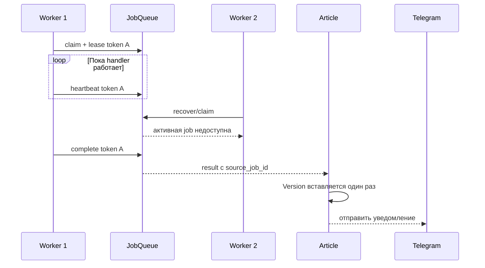

# Исправления по техническому аудиту — этап 1

**Дата:** 12 августа 2026 года
**Ветка:** `codex/technical-hardening-saas-plan`

## Начало

Code review и архитектурный аудит выявили несколько дефектов, которые могли приводить к исчезновению Плана после полной перегенерации, двойному выполнению долгих задач, зависанию Статьи после ошибки, дублированию Версий и конфликтующим решениям заявок на доступ.

## Цель задачи

Точечно закрыть наиболее опасные дефекты выполнения и конкурентности, не меняя пользовательский Telegram-first сценарий и не переходя к линтерам или новой ветке.

## Что проделано

### План

- Полная перегенерация использует отдельную generation identity и больше не конфликтует с завершённой недельной job.
- Повтор одного callback остаётся идемпотентным.
- Replacement job ставится в очередь до архивирования исходного Плана; ошибка enqueue не уничтожает активный План.
- Добавлен partial unique index для одного `pending_review` Плана на неделю.
- `add_topics` использует race-safe upsert и блокировку строки Плана.
- Устаревший результат регенерации Темы возвращает typed domain error вместо ложного сообщения об успехе.

### Очередь

- Каждый claim получает уникальный `lease_token`.
- Worker продлевает lease heartbeat во время длительного handler.
- `complete` и `fail` применяются только владельцем актуального lease.
- `recover_stuck` очищает только действительно просроченные lease.
- Ручной retry разрешён только для окончательно `failed` job; для остальных статусов возвращается no-op.

### Статья и результаты

- Article связывается с активной generation job.
- Окончательный fail переводит только актуальную Article в `error`.
- Устаревший success/failure не перезаписывает более новую генерацию.
- `source_job_id` служит application receipt: повтор notification не создаёт вторую Версию.
- Применение результата в БД выполняется до Telegram side effect.

### Доступ

- Решение заявки заменено на атомарный `UPDATE ... WHERE status='pending' RETURNING`.
- Membership и уведомления выполняет только Owner, выигравший переход состояния.
- Параллельный второй клик становится безопасным no-op.

## Что стало работать

- Долгая генерация не должна одновременно запускаться вторым worker при живом heartbeat.
- Worker со старым токеном не может завершить повторно захваченную job.
- Повтор обработки одного результата не создаёт дубликат Версии.
- После окончательной ошибки Статью можно повторно запустить из состояния `error`.
- Полная перегенерация недели создаёт новую job, не переиспользуя старую `done`.

## Общее видение проекта после работы

Проект остаётся single-tenant MVP, но его базовые workflow теперь ближе к at-least-once-safe архитектуре: очередь имеет lease fencing, домен различает актуальные и устаревшие результаты, а ключевые конкурентные переходы закреплены SQL-условиями.

## Проверка

- AST-разбор всех 112 Python-файлов: успешно.
- `git diff --check`: успешно.
- Добавлены targeted tests для Планов, очереди, Статей, notifications и заявок.
- Полный pytest не выполнен: в доступном окружении отсутствуют `uv`, `pytest` и `asyncpg`.
- Live Telegram, Yandex и LLM API не вызывались.

## Что осталось

1. Прогнать targeted и полный pytest в проектном окружении из `uv.lock`.
2. Ввести версионные миграции вместо schema-on-startup.
3. Перед созданием unique index очистить возможные существующие дубли `pending_review` Планов одной недели.
4. Сделать transactional outbox/canonical Telegram message, если потребуется строгая защита от повторной отправки сообщения.
5. Добавить startup reconciliation недельного scheduler.
6. Продолжить аудит: Research Bundle, claim-to-citation, structured output, sensitive classifier и Wordstat ranking.

## Rollback и эксплуатация

- Новые колонки `lease_token`, `active_generation_job_id` и `source_job_id` nullable и совместимы со старыми строками.
- Перед production rollout нужен backup и проверка дублей Планов; уникальный индекс нельзя накатывать вслепую.
- Если heartbeat создаёт неожиданную нагрузку, cadence управляется `stuck_timeout / 3`, но отключать fencing нельзя.
- Fencing защищает состояние БД, но не отменяет внешний API-вызов handler после потери lease. Внешние интеграции должны оставаться идемпотентными или получать собственные operation keys.
- Telegram не предоставляет exactly-once delivery: после успешной отправки и падения до `mark_notified` сообщение может повториться, хотя Версия Статьи уже не продублируется.
