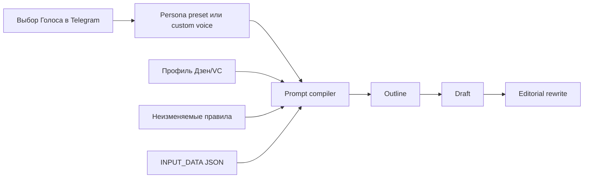

# Persona v1 и безопасные промпты Статьи

**Дата:** 12 августа 2026 года
**Ветка:** `codex/technical-hardening-saas-plan`

## Начало

До изменения Голос автора хранился одной свободной строкой и напрямую попадал в system prompt. Площадка передавалась как `zen` или `vc`, но не имела явного редакционного контракта. Поэтому разные Голоса и Площадки слабо влияли на измеримые свойства материала, а пользовательский текст мог содержать prompt injection.

## Цель задачи

Добавить содержательные стартовые Persona и улучшить промпты написания Статьи, сохранив текущий Telegram-first сценарий и совместимость с ранее записанными значениями `/set_voice`.

## Что проделано

- Добавлена типизированная модель `Persona` и четыре стартовых профиля:
  - Маркетолог-практик;
  - Доказательный аналитик;
  - Фаундер-оператор;
  - Понятный наставник.
- Каждая Persona описывает роль, аудиторию, тон, экспертность, структуру текста, лексику, CTA и запрещённые паттерны.
- Добавлены отдельные `PlatformProfile` для Дзена и VC.ru.
- Кнопки `/voice` теперь сохраняют стабильные preset keys, но показывают пользователю понятные русские названия.
- Старые свободные значения Голоса продолжают работать через compatibility adapter.
- Outline, draft и rewrite переведены на общий layered prompt builder.
- Пользовательские title, summary, keywords, comment, previous content, outline, draft и custom voice передаются внутри JSON-блока `INPUT_DATA`.
- Добавлены targeted-тесты для Persona, профилей площадок, prompt layering, обратной совместимости и недоверенных комментариев.

## Что стало работать

- Одна Persona последовательно применяется на outline, draft и редакторском rewrite.
- Дзен получает доступное повествовательное изложение, короткие абзацы, объяснение терминов и мягкий CTA.
- VC.ru получает деловой тезис, механику решения, evidence, ограничения/риски и практический вывод.
- Custom voice и комментарий редактора больше не смешиваются с исполняемыми системными правилами.
- Rewrite явно запрещено добавлять новые факты и изменять числа.
- Неизвестная площадка завершается typed `ValueError`, а не получает неопределённый prompt.

## Общее видение проекта после работы

Текущая реализация — первый совместимый слой Persona, а не окончательная SaaS-модель. Она уже улучшает качество промпта без миграции БД. Следующим этапом Persona станет версионированной доменной сущностью с эталонными текстами, preview/approve и snapshot в каждой Версии Статьи.

## Проверка

- AST parsing: успешно, 112 Python-файлов.
- `git diff --check`: успешно.
- Smoke/import: не выполнен, в доступном Python отсутствует `asyncpg`.
- Targeted pytest: не выполнен, в доступном Python отсутствует `pytest`.
- Live Yandex/Telegram API: намеренно не вызывались.

## Что осталось

1. Установить зависимости из `uv.lock` и выполнить targeted pytest.
2. Ввести таблицы `personas`, `persona_versions`, `persona_samples` через версионную миграцию.
3. Добавить Telegram flow `создать → preview → подтвердить → активировать`.
4. Сохранять `persona_version_id`, platform-profile version/hash и prompt-template version в Версии Статьи.
5. Добавить анализ 2–5 эталонных текстов и confidence/missing inputs.
6. Реализовать Research Bundle и claim-to-citation validation; текущий sources step по-прежнему проверяет только доступность URL.
7. Добавить offline quality eval и сравнение Persona на одинаковых Темах.

## Rollback и эксплуатация

Изменение не требует миграции БД. Для отката достаточно вернуть старые prompt functions и прежний список `VOICE_TEMPLATES`; существующие custom voice остаются строками и не теряются. Новые значения вида `preset:<key>` при откате будут отображаться как обычный текст, поэтому перед production rollback желательно заменить активный preset на совместимое текстовое значение.
