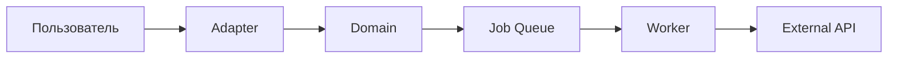
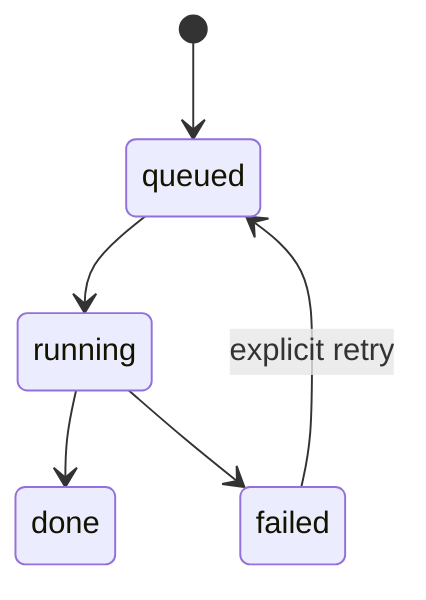
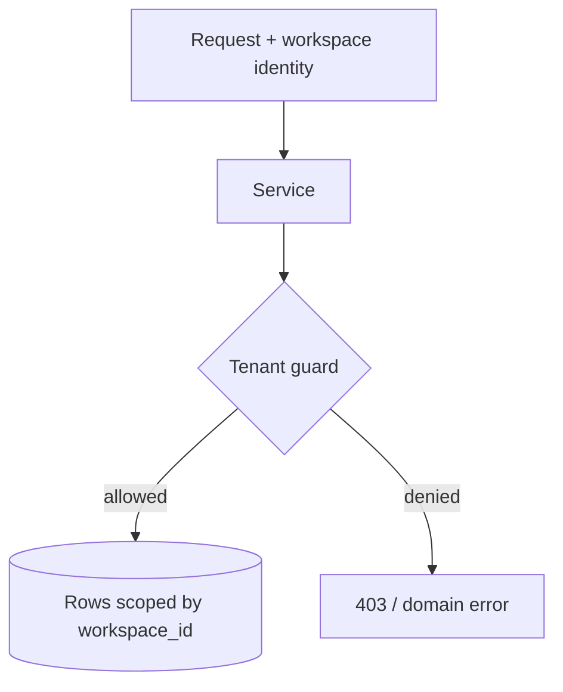

# Стандарт итогового артефакта задачи

Каждая завершённая существенная задача должна оставлять короткий Markdown-артефакт в `docs/deliverables/`. Для архитектурных, пользовательских или release-задач артефакт обязателен; для мелкого локального исправления достаточно полноценного PR description по тому же шаблону.

## Имя файла

```text
docs/deliverables/YYYY-MM-DD-<short-task-name>.md
```

## Обязательная структура

```markdown
# <Название результата>

## Начало
- Дата, ветка/commit, исходное состояние.
- Связанная issue/spec/ADR.

## Цель задачи
- Какая проблема решалась.
- Проверяемый результат и явно исключённый scope.

## Что проделано
- Краткий список фактических изменений.
- Основные затронутые файлы и миграции.
- Ключевые решения и trade-offs.

## Что стало работать
- Пользовательские сценарии, которые теперь доступны.
- Исправленные инварианты и автоматические проверки.
- Ограничения: что всё ещё не гарантируется.

## Общее видение проекта после работы
- Как изменилось место компонента в системе.
- Как решение поддерживает следующую фазу продукта/SaaS.

## Схемы
- Диаграмма потока, состояния или компонентов, если задача меняет 3+ связанных узла.
- Схема «до/после», если без неё трудно понять изменение.

## Проверка
- Точные команды и PASS/FAIL/SKIPPED.
- Targeted tests, Ruff, CI и ручные проверки.
- Для SKIPPED — причина и владелец следующей проверки.

## Что осталось
- Незавершённые пункты, residual risks и технический долг.
- Следующие шаги в приоритетном порядке и их owner.

## Rollback и эксплуатация
- Как откатить изменение.
- Новые миграции, настройки, метрики, alerts и runbook.
```

## Когда нужна схема

Используйте Mermaid, если выполняется хотя бы одно условие:

- меняется поток через три и более компонента;
- меняется lifecycle/машина состояний;
- добавляется очередь, retry, lease, webhook или асинхронная доставка;
- добавляется multi-tenancy или новый trust boundary;
- до/после имеют разные ownership или dependency direction.

Для локального изменения одной функции схема не нужна.

## Минимальные Mermaid-шаблоны

### Поток данных



### Lifecycle



### Multi-tenant boundary



## Правила качества

- Писать о фактически выполненном, а не копировать первоначальный план.
- Не заявлять, что что-то работает, если проверка была `SKIPPED`.
- Ссылаться на файлы, ADR, миграции и отчёты вместо общих формулировок.
- Не включать secrets, environment dumps, персональные данные и сырые приватные prompts.
- Артефакт должен быть понятен человеку, который не читал рабочий чат.
